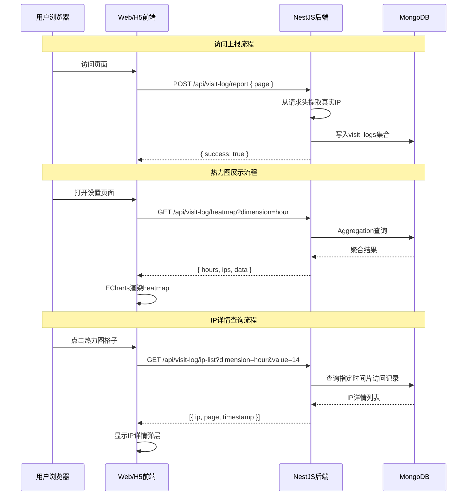

## 用户需求

在Web「设置」页面内新增访问热力图功能，具体需求如下：

### 产品概述

本功能用于监控和可视化网吧数据平台（Web端和H5端）的用户访问情况，以IP为维度进行热力图展示，帮助管理员了解访问分布。

### 核心功能

1. **访问监听**：同时监听Web所有页面（`/`, `/settings`）和H5页面（`/h5`）的用户访问，采集IP、访问页面、UserAgent、时间戳等信息
2. **热力图展示**：在「设置」页面内新增热力图区块，以IP为维度，时间片为横轴，颜色深浅代表访问频次
3. **时间维度切换**：支持「按小时」（0-23时）和「按天」（最近N天）两种时间粒度切换
4. **点击交互**：点击热力图小格子，弹出浮层（toast）显示该时间片内访问的IP列表详情（IP、访问页面、访问时间）
5. **数据持久化**：新增MongoDB集合 `visit_logs` 存储访问日志

## 技术栈

- **前端**：Vue 3（Composition API + `<script setup>`）、Tailwind CSS、ECharts 6.x（heatmap图表）、Axios
- **后端**：NestJS 11、TypeScript、Mongoose（MongoDB）
- **数据库**：MongoDB，新增 `visit_logs` 集合

## 实现方案

### 后端实现

#### 模块结构（遵循现有模式，参考 `store-order` 模块）

新增 `visit-log` 模块，包含以下文件：

- `visit-log/schemas/visit-log.schema.ts` — MongoDB Schema定义
- `visit-log/dto/report-visit.dto.ts` — 上报访问DTO（可选，因上报数据来自请求头）
- `visit-log/dto/query-heatmap.dto.ts` — 查询热力图参数校验DTO
- `visit-log/visit-log.service.ts` — 业务逻辑层
- `visit-log/visit-log.controller.ts` — 控制器层
- `visit-log/visit-log.module.ts` — 模块定义

#### Schema设计

```typescript
// visit-log.schema.ts
@Schema({ collection: 'visit_logs', timestamps: true })
export class VisitLog {
  @Prop({ required: true, index: true })
  ip: string;

  @Prop({ required: true, index: true })
  page: string; // 访问页面路径，如 '/', '/settings', '/h5'

  @Prop()
  userAgent: string;

  @Prop()
  referer: string;

  @Prop({ required: true, index: true })
  timestamp: Date; // 访问时间

  @Prop({ required: true, index: true })
  date: string; // YYYY-MM-DD 格式，便于按天聚合
}
```

索引策略：

- `ip` — 单字段索引，用于IP查询和聚合
- `timestamp` — 单字段索引，用于时间范围查询
- `date` — 单字段索引，用于按天聚合
- `{ date: 1, ip: 1 }` — 复合索引，加速按天+IP的聚合查询
- `{ timestamp: -1 }` — 倒序索引，用于获取最近访问

#### Service层核心方法

**1. `reportVisit(req, body)` — 上报访问**

- 从请求头获取真实IP：`X-Forwarded-For`（nginx代理场景）或 `req.ip`
- 获取 `page`（当前页面路径）、`userAgent`、`referer`
- 写入 `visit_logs` 集合
- 返回 `{ success: true }`

**2. `getHeatmapData(dimension, date?)` — 获取热力图聚合数据**

- 使用MongoDB Aggregation Pipeline进行聚合
- **按小时维度**：
- Match阶段：筛选指定日期（默认今天）的数据
- Group阶段：按 `hour`（从timestamp提取）和 `ip` 分组，计算 `count`
- 二次Group：按 `hour` 分组，收集该小时内的所有 `{ ip, count }`
- 输出： `{ hours: [0..23], ips: [...], data: [[hourIdx, ipIdx, count], ...] }`
- **按天维度**：
- Match阶段：筛选最近N天（默认7天）
- Group阶段：按 `date` 和 `ip` 分组
- 输出： `{ dates: [...], ips: [...], data: [[dateIdx, ipIdx, count], ...] }`
- IP过多时只保留访问次数最多的TOP 50个IP（避免y轴过长）

**3. `getIpList(dimension, value)` — 获取指定时间片的IP详情**

- `dimension=hour` 时，`value` 为小时数（0-23），查询指定日期该小时内的所有访问记录
- `dimension=day` 时，`value` 为日期字符串，查询该日期内的所有访问记录
- 返回： `[{ ip, page, timestamp, userAgent }, ...]`

#### Controller层接口

| 方法 | 路径 | 说明 |
| --- | --- | --- |
| POST | `/api/visit-log/report` | 上报访问（body: `{ page }`，IP从请求头获取） |
| GET | `/api/visit-log/heatmap?dimension=hour&date=2026-05-21` | 获取热力图数据 |
| GET | `/api/visit-log/ip-list?dimension=hour&value=14` | 获取指定时间片的IP列表 |


#### 注册模块

在 `app.module.ts` 的 `imports` 数组中新增 `VisitLogModule`。

### 前端实现

#### 访问上报（全局）

**Web端（`frontend/src/main.js` 或 `router/index.js`）：**

- 使用 `router.afterEach` 全局后置钩子
- 每次路由切换完成后，调用 `reportVisit({ page: to.path })`
- 在请求拦截器中不需要额外处理

**H5端（`frontend/src/pages/H5OnlineRate.vue`）：**

- 在 `onMounted` 中调用 `reportVisit({ page: '/h5' })`
- 如果H5是单页应用且有内部路由，也使用类似 `router.afterEach` 的方式

#### API层（`frontend/src/api/visitLog.js`）

```javascript
import axios from 'axios'

const api = axios.create({
  baseURL: import.meta.env.VITE_API_BASE_URL || 'http://localhost:3000/api',
  timeout: 10000,
})

export const reportVisit = (data) => {
  return api.post('/visit-log/report', data)
}

export const getHeatmapData = (params) => {
  return api.get('/visit-log/heatmap', { params })
}

export const getIpList = (params) => {
  return api.get('/visit-log/ip-list', { params })
}
```

#### 热力图页面（`frontend/src/pages/StoreOrder.vue` 改造）**

在现有门店排序区域下方新增热力图区块：

**UI结构：**

1. 区块标题：「访问热力图」
2. 维度切换按钮：「按小时」/ 「按天」（toggle切换样式）
3. 日期选择（按小时维度时选单日，按天维度时选起始日期范围）
4. ECharts heatmap 图表容器
5. IP详情弹层（点击格子时显示）

**ECharts Heatmap 配置：**

```javascript
const option = {
  tooltip: {
    position: 'top',
    formatter: (params) => {
      // 点击时触发获取IP列表
      return `<div>时间：${params.name}<br/>IP：${params.value[1]}<br/>访问次数：${params.value[2]}</div>`
    }
  },
  grid: { left: 120, right: 60, top: 60, bottom: 60 },
  xAxis: {
    type: 'category',
    data: hours, // 或 dates
    splitArea: { show: true }
  },
  yAxis: {
    type: 'category',
    data: ips, // 去重IP列表（TOP 50）
    splitArea: { show: true }
  },
  visualMap: {
    min: 0,
    max: maxCount,
    calculable: true,
    orient: 'horizontal',
    left: 'center',
    bottom: 0,
    inRange: { color: ['#ebedf0', '#9be9a8', '#40c463', '#30a14e', '#216e39'] } // GitHub风格配色
  },
  series: [{
    name: '访问热力图',
    type: 'heatmap',
    data: heatmapData, // [[xIdx, yIdx, count], ...]
    label: { show: false },
    emphasis: {
      itemStyle: { shadowBlur: 10, shadowColor: 'rgba(0, 0, 0, 0.5)' }
    }
  }]
}
```

**点击交互实现：**

- 监听 ECharts `click` 事件
- 获取点击位置的 `dataIndex`，解析出对应的 `hour`/`date` 和 `ip`
- 调用 `getIpList` 接口获取该时间片内的IP详情列表
- 显示自定义弹层（fixed定位，白色背景，圆角阴影），展示：
- IP地址
- 访问页面（转为中文显示：'/' → '上座率对比', '/settings' → '设置', '/h5' → 'H5页面'）
- 访问时间（格式化显示）
- UserAgent（可选，折叠显示）
- 点击弹层外部或ESC键关闭

**响应式处理：**

- 小屏幕时y轴IP列表可横向滚动或折叠显示
- 弹层在小屏幕上全屏显示或居中弹窗

#### 侧边栏

无需修改，热力图放在「设置」页面内，作为新增区块。

### 数据流图



### 性能优化

1. **MongoDB索引**：为 `ip`, `timestamp`, `date` 字段建立索引，加速聚合查询
2. **聚合限制**：热力图查询默认限制时间范围（按小时查当天，按天查最近7天），避免全表扫描
3. **IP数量限制**：y轴只显示访问次数最多的TOP 50个IP，避免图表过于密集
4. **数据上报异步**：访问上报使用 `fire-and-forget` 模式，不阻塞页面加载
5. **ECharts渲染优化**：`data` 数组过大时使用 `large: true` 大数据模式

### 错误处理

1. **上报失败**：访问上报失败不应影响用户正常使用，使用静默失败（catch后不提示）
2. **查询无数据**：热力图区域显示「暂无访问数据」空状态提示
3. **IP详情查询失败**：弹层显示「加载失败，请重试」

## 目录结构

```
backend/src/
├── visit-log/                          # [NEW] 访问日志模块
│   ├── schemas/
│   │   └── visit-log.schema.ts        # [NEW] VisitLog Schema定义
│   ├── dto/
│   │   ├── report-visit.dto.ts        # [NEW] 上报访问DTO（可选）
│   │   └── query-heatmap.dto.ts       # [NEW] 查询参数校验DTO
│   ├── visit-log.service.ts            # [NEW] 访问日志业务逻辑
│   ├── visit-log.controller.ts         # [NEW] 访问日志控制器
│   └── visit-log.module.ts            # [NEW] VisitLog模块定义
├── app.module.ts                       # [MODIFY] 注册VisitLogModule

frontend/src/
├── api/
│   └── visitLog.js                     # [NEW] 访问日志API封装
├── pages/
│   └── StoreOrder.vue                  # [MODIFY] 新增热力图区块
├── router/
│   └── index.js                        # [MODIFY] 可选，添加全局上报钩子
└── main.js                             # [MODIFY] 添加路由后置钩子用于访问上报
```

## 设计风格

采用与现有项目一致的现代简约风格，延续现有的配色体系（slate灰色系为主，emerald绿色为状态色）。

## 页面结构设计

### 设置页面新增热力图区块

在 `StoreOrder.vue` 的门店排序区域下方新增「访问热力图」独立区块，与上方区域保持一致的圆角卡片风格。

#### 区块1：区块标题区

- 标题：「访问热力图」
- 副标题：「监控Web和H5页面的访问分布情况」
- 样式：与现有页面标题风格一致（bg-gradient-to-r from-slate-800 to-slate-700 rounded-2xl）

#### 区块2：控制面板区

- 维度切换按钮组：「按小时」/ 「按天」toggle切换
- 选中状态：bg-slate-800 text-white
- 未选中状态：bg-white text-slate-600 border border-gray-200
- 圆角：rounded-xl，按钮组间距2px
- 日期选择：
- 按小时维度：单个日期选择器（默认今天）
- 按天维度：日期范围选择器（默认最近7天）
- 样式：bg-white rounded-2xl shadow-sm border border-gray-100 p-5

#### 区块3：热力图图表区

- ECharts heatmap渲染区域，高度400px
- x轴标签：小时(0-23) 或 日期(MM-DD)
- y轴标签：IP地址（只显示前8位+...，hover显示完整IP）
- 颜色方案：GitHub贡献图风格（浅灰→深绿渐变）
- 样式：bg-white rounded-2xl shadow-sm border border-gray-100 p-6

#### 区块4：IP详情弹层

- 触发：点击热力图任意格子
- 位置：鼠标点击位置附近（避免超出视口）
- 样式：
- bg-white rounded-2xl shadow-2xl
- 最大高度400px，溢出滚动
- 每个IP条目：IP地址 + 访问页面标签 + 访问时间
- 关闭按钮：右上角 X 按钮
- 背景遮罩：bg-black/30 backdrop-blur-sm

## Agent Extensions

### Skill

- **code-explorer**
- Purpose: 在需要跨多个文件、目录或模式进行搜索时调用，用于深入理解现有代码库结构
- Expected outcome: 获取现有模块的详细实现模式，确保新增模块与之保持一致